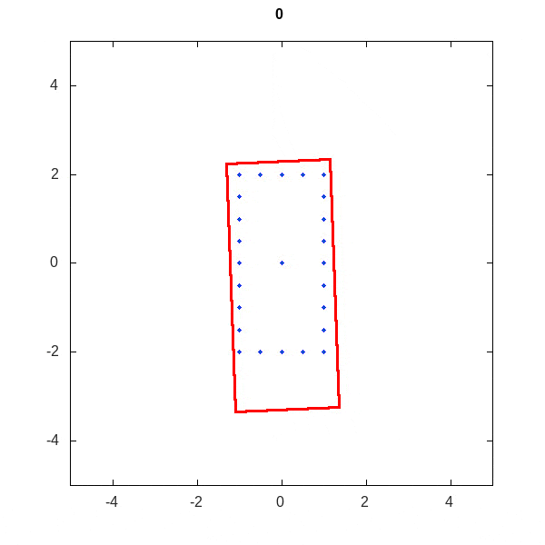
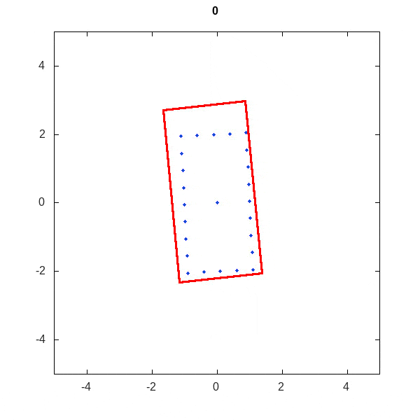

# EOT-cpp

## Build from source

```Shell
git clone https://github.com/EricAlex/EOT-cpp.git
mkdir build && cd build
cmake ../EOT-cpp
make
```

## Simulation results

### One simple rectangular object

#### Static



#### Constant turning rate



#### Accelerated turning rate


### Multiple rectangular objects moving with random acceleration

- The dimensions of the objects are random;

- The number of measurements and the measurement position on the objects are random;

- The measurements are noisy with clutters.


# References

Meyer, F., & Williams, J. L. (2021). Scalable detection and tracking of geometric extended objects. IEEE Transactions on Signal Processing, 69, 6283-6298.

Meyer, F., & Win, M. Z. (2020). Scalable data association for extended object tracking. IEEE Transactions on Signal and Information Processing over Networks, 6, 491-507.
